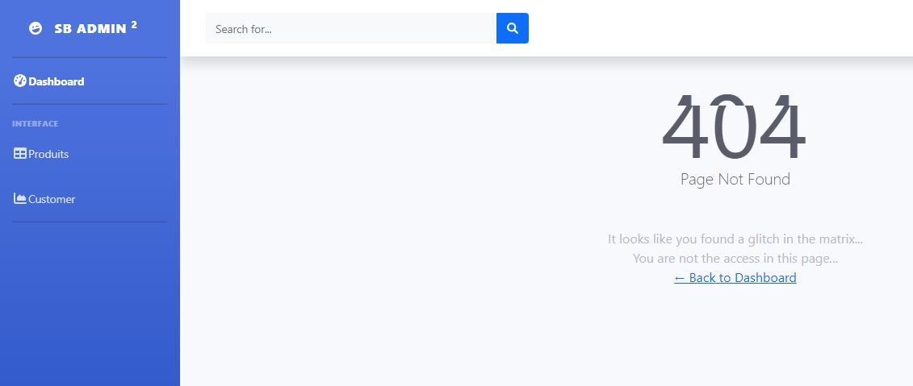

<h1>Compte Rendu Projet Systèmes Distribués</h1>

<h2>1. Mettre en place les micro-services</h2>
<ul>
    <li>a. Customer-Service</li>
    <li>b. Inventory-Service</li>
    <li>c. Billing-Service</li>
    <li>d. Eureka Discovery Service</li>
    <li>e. Spring Cloud Gateway</li>
    <li>f. Product-Service</li>
</ul>
<h2>2. Mise en place du service de Sécurité avec Keycloak</h2>
<ul>
    <li>Mettre en place le serveur d’authentification OAuth2 Keycloak version 12.0.1</li>
    
    <li>Créer un Realm</li>
    
    <li>Le client à sécuriser en mode public client</li>
    
    <li>Créer les rôles (USER, ADMIN, PRODUCT_MANAGER, CUSTOMER_MANAGER et BILLING_MANAGER) </li>
    
    <li>Créer quelques utilisateurs, Affecter les rôles aux utilisateurs</li>
    
    <li>Personnaliser le paramétrage des timeout des tokens</li>
    
    Refresh token : 30min
    Access token : 20min
</ul>
<h2>3. Sécurité l’ensemble des micro-services fonctionnels en mode Bearer-Only</h2>
<ul>
    <li>Configuration real pour application.proprties</li>
    
    <li>Keycloak configuration</li>
    
</ul>
<h2>4. Développer une application Web Front End</h2>
<h4>Pour l'application web j'ai permis d'utilisé le framawork de javascript Angular</h4>
 
<h6>ROLE_CUSTOMER_SERVICE</h6>
<ul>
    <li>Configuration keycloak</li>
    
    <li>Home page</li>
    
    <li>Login page</li>
    
    <li>Home apres sign-in par un customer utilisateur</li>
    
    <li>Résultat de la cConsulation de la page produit par un customer</li>
    
    <li>Page customer</li>
    
    <li>Ajouter des produit au panier</li>
    
    Apès l'achat la quantité de chaque produit a été modifie
    <li>Générer une facture</li>
    
</ul>
<h6>ROLE_PRODUCT_SERVICE</h6>
<ul>
    <li>Interface product</li>
    
    <li>Ajouter un produit 5</li>
    
    <li>Modifié les information de produit 1</li>
    
    <li>Supprimé le produit 3</li>
    
</ul>
<h2>5. Sécuriser l’application FrontEnd en mode public client</h2>

<h2>6. Personnaliser la sécurité de la partie frontend</h2>
<ul>
    <li>Auto-inscription des utilisateurs</li>
    
    <li>Politique des mots de passe</li>
    
    <li>Double authentification OTP</li>
    
    <li>...</li>
</ul>
<h2>7. Mise en place d’une solution de messagerie asynchrone avec le Broker KAFKA</h2>
<ol>
    <li>Mettre en place le Broker KAFKA</li> 
    
    <li>Producer KAFKA</li> 
    
    <li>Mettre en place le Broker KAFKA</li> 
    
    <li>Broker KAFKA permet d’envoyer à un tompic « FACTURATION »</li> 
    <ul>
        <li>Configuration application.properties de Producer</li>
        
        <li>La Création des factures aléatoirement et de les envoyés au Broker Kafka chaque seconde</li>
        
    </ul>
    <li>consommer les messages du Topic « FACTURATION »</li>
    <ul>
        <li>Configuration application.properties de consumer</li>
        
        <li>La Création des factures aléatoirement et de les envoyés au Broker Kafka chaque seconde</li>
        
    </ul>
</ol>